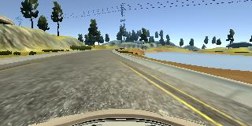

# Project 3: Use Deep Learning to Clone Driving Behavior

The original read me before I forked the project can be found [here](README_original.md).

The [git repository](https://github.com/carltonwin8/CarND-Behavioral-Cloning-P3)
contains the following project files.

  - [model.py](model.py) - script used to create and train the model
  - [drive.py](drive.py) - script used to drive the car
  - [model.h5](model.h5) - the trained Keras model
  - [README.md](README.md) and [README.pdf](README.pdf) summarizing the results

The [model.py](model.py) expects the data files to be in the parent directory.
Change line 19 in the code if your data is located in a different directory.

## Video Results  

The simulator running in autonomous mode with the trained and saved model can be
seen at the links below.

  - [Video of track 1](https://youtu.be/W7PfYQfNAAo)
  - [Video of track 2](https://youtu.be/bm2GNCcLV7U)

## Model Architecture

The model is based on the NVIDIA model described
[here](http://images.nvidia.com/content/tegra/automotive/images/2016/solutions/pdf/end-to-end-dl-using-px.pdf)

| code line | Description  
| --- | ---
|  55 | Crops the image by 50 pixels on the top and 20 pixels on the bottom
|  56 | Normalizes the image data to be between -0.5 to 0.5 via a lambda function
|  57 | Use a convolution layer with a 5x5 filter with a depth of 24. Use a relu activation function to add **non-linearity**.
|  58 | Uses max pooling with a stride of 2x2 to reduce the number of model variables
|  59 | Use a convolution layer with a 5x5 filter with a depth of 36.
|  60 | Uses max pooling with a stride of 2x2 to reduce the number of model variables
|  61 | Use a convolution layer with a 5x5 filter with a depth of 48.
|  62 | Uses max pooling with a stride of 2x2 to reduce the number of model variables
|  63 | Uses a dropout layer with a 0.25 probability in order to not **over fit**
|  64 | Use a convolution layer with a 3x3 filter with a depth of 64. Use a relu activation function to add **non-linearity**.
|  65 | Use a convolution layer with a 3x3 filter with a depth of 64.
|  66 | Flatten the matrix for the following dense/linear operations.
|  67 | Use the fully connected dense layer to reduce the output dimension to 100. Use a relu activation function to add **non-linearity**.
|  68 | Use the fully connected dense layer to reduce the output dimension to 50.
|  69 | Use the fully connected dense layer to reduce the output dimension to 10.
|  70 | Use the fully connected dense layer to reduce the output dimension to 1.
|  71 | Use the Adam optimizer with a MSE loss function. The learning rate was **not tuned manually**.

## Training Strategy

 - In order to verify the correctness of my initial model it was run with an input of 3 images and steering angles.
   The images and steering angles are presented in the _Images Section_ at the end of this document.
   The model converged and produced a small MSE in **5 epocs**. All future training was done with 5 epocs.
 - That model was then trained with the provided data set but only using the center image and steering angle.
   The saved model was run with the simulator in autonomous mode and the car crashed at the very first turn.
 - The model was then refined by adding non-linearities via relus and over fitting was reduced via a drop out.
 - After training, the car drove around a number of corners but went off road after the bridge.
 - On subsequent training and model changes it was noted that every failure was caused by the car not recovering
   once it went too far off the center line of the road.
 - The left and right camera angles were then added to the training with a steering angle adjustment of 0.2.
   The car did much better at recovering from being off center but still drove off the track at some point.
 - When the steering angle adjustment of the left and right cameras was adjusted to 0.4 the car could drive
   around both tracks.

It is exciting to note that even though the car was trained only on one track, that it could
navigate successfully on a second track that was significantly different.
This tells us that the model and training are general enough and the model did not over fit the training data for only one track.

## Training Set

**Only the data provided** was used for training.
The extra training data generated by myself was not used because the car stayed on
both tracks using just the provided data.
I did not have to flip images in order for the car to stay on the more right turn centric track.
The provided data was split into a training and test set buy using the default split
of the _sklearn_ _train_test_split_ function (0.25 test and 0.75 train).
The training data was shuffled before it was used in training in order not to
bias the model early on by one-type-off/similar data.

## Images

The images shown below were used to verify the correctness of the initial model.

### Driving Angle 0

### Driving Angle 1

### Driving Angle -0.9426954

